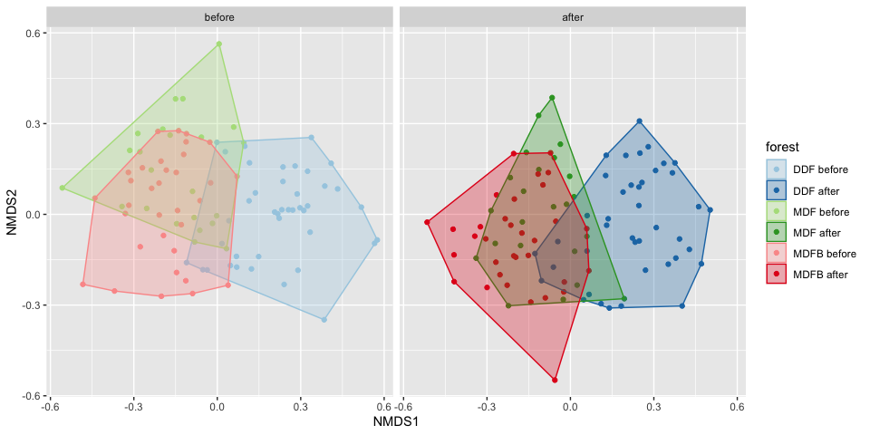
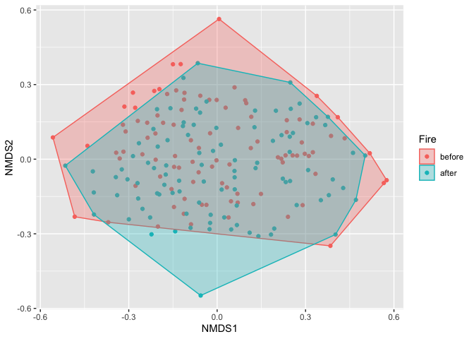

PERMANOVA on understory plant data
================
Ekaphan Kraichak
2022-11-01

## load the libraries

``` r
library(tidyverse)
```

    ## ── Attaching packages ─────────────────────────────────────── tidyverse 1.3.2 ──
    ## ✔ ggplot2 3.3.6     ✔ purrr   0.3.4
    ## ✔ tibble  3.1.8     ✔ dplyr   1.0.9
    ## ✔ tidyr   1.2.0     ✔ stringr 1.4.0
    ## ✔ readr   2.1.2     ✔ forcats 0.5.1
    ## ── Conflicts ────────────────────────────────────────── tidyverse_conflicts() ──
    ## ✖ dplyr::filter() masks stats::filter()
    ## ✖ dplyr::lag()    masks stats::lag()

``` r
library(vegan)
```

    ## Loading required package: permute
    ## Loading required package: lattice
    ## This is vegan 2.6-4

## import data

``` r
env <- read.csv("Environmental_matrix.csv")
comm <- read.csv("UnderGrowth_matrix.csv")
```

## clean data

combine env and comm to select only the plot that experience fire to
make sure that they are in the same order. Filter only the plot with
fire

``` r
comm.env <- env %>% 
  select(Plot, Fire, Fire.appear, forest.type) %>%
  mutate(forest.type = recode(forest.type, "MDF,bamboo" = "MDFB", "OpenArea" = "OA")) %>% 
  inner_join(comm, by = c("Plot", "Fire")) %>% 
  filter(Fire.appear == "Fire") %>% 
  filter(!(Plot %in% c(123, 124, 115))) ## these plots are OA and way outliers. Plot 115 is also acting weird

comm.env.E0 <- comm.env[,1:4] ## environmental matrix
comm.env.C0 <- comm.env[,5:484] 
```

after all the filtering, some species disappear from the matrix. We will
select only species that occur in more than 20 plots (remove rare
species)

``` r
main.species <- names(which(colSums(comm.env.C0 > 0) > 20))


comm.env.C1 <- comm.env.C0[,main.species]
## find not empty row
not.empty <- which(rowSums(comm.env.C1) > 0)

comm.env.C <- wisconsin(comm.env.C1[not.empty, main.species])
## community matrix with Wisconsin double standardization
comm.env.E <- comm.env.E0[not.empty, ]
```

## run PERMANOVA using adonis

``` r
perm <- how(nperm = 9999)
setBlocks(perm) <- with(comm.env.E, forest.type)
adonis2(comm.env.C ~ Fire*forest.type, data = comm.env.E, permutations = perm)
```

    ## Permutation test for adonis under reduced model
    ## Terms added sequentially (first to last)
    ## Blocks:  with(comm.env.E, forest.type) 
    ## Permutation: free
    ## Number of permutations: 9999
    ## 
    ## adonis2(formula = comm.env.C ~ Fire * forest.type, data = comm.env.E, permutations = perm)
    ##                   Df SumOfSqs      R2      F Pr(>F)    
    ## Fire               1    1.320 0.01597 3.3549 0.0001 ***
    ## forest.type        2    6.458 0.07813 8.2094 0.0001 ***
    ## Fire:forest.type   2    0.929 0.01124 1.1810 0.1575    
    ## Residual         188   73.951 0.89466                  
    ## Total            193   82.658 1.00000                  
    ## ---
    ## Signif. codes:  0 '***' 0.001 '**' 0.01 '*' 0.05 '.' 0.1 ' ' 1

## visualize the data via MDS

``` r
mod <- metaMDS(comm.env.C, trymax = 3000, k = 3)
```

    ## Run 0 stress 0.2262175 
    ## Run 1 stress 0.224262 
    ## ... New best solution
    ## ... Procrustes: rmse 0.03198441  max resid 0.1094139 
    ## Run 2 stress 0.2272978 
    ## Run 3 stress 0.2237349 
    ## ... New best solution
    ## ... Procrustes: rmse 0.01186176  max resid 0.08085284 
    ## Run 4 stress 0.2248303 
    ## Run 5 stress 0.2242075 
    ## ... Procrustes: rmse 0.01768125  max resid 0.1181469 
    ## Run 6 stress 0.2244398 
    ## Run 7 stress 0.2237915 
    ## ... Procrustes: rmse 0.01010013  max resid 0.09119954 
    ## Run 8 stress 0.2236917 
    ## ... New best solution
    ## ... Procrustes: rmse 0.008116724  max resid 0.06648525 
    ## Run 9 stress 0.2256749 
    ## Run 10 stress 0.2259296 
    ## Run 11 stress 0.2242273 
    ## Run 12 stress 0.227242 
    ## Run 13 stress 0.2270718 
    ## Run 14 stress 0.2240143 
    ## ... Procrustes: rmse 0.01454584  max resid 0.09143681 
    ## Run 15 stress 0.224405 
    ## Run 16 stress 0.2289165 
    ## Run 17 stress 0.2266355 
    ## Run 18 stress 0.2252162 
    ## Run 19 stress 0.2250555 
    ## Run 20 stress 0.2258395 
    ## Run 21 stress 0.2242699 
    ## Run 22 stress 0.2240448 
    ## ... Procrustes: rmse 0.01693084  max resid 0.1273552 
    ## Run 23 stress 0.2247413 
    ## Run 24 stress 0.2236842 
    ## ... New best solution
    ## ... Procrustes: rmse 0.006588747  max resid 0.04875056 
    ## Run 25 stress 0.2245056 
    ## Run 26 stress 0.2241677 
    ## ... Procrustes: rmse 0.01495932  max resid 0.1175296 
    ## Run 27 stress 0.2244665 
    ## Run 28 stress 0.2238326 
    ## ... Procrustes: rmse 0.01075838  max resid 0.08124198 
    ## Run 29 stress 0.22436 
    ## Run 30 stress 0.2240759 
    ## ... Procrustes: rmse 0.01071378  max resid 0.1089208 
    ## Run 31 stress 0.2240675 
    ## ... Procrustes: rmse 0.01409747  max resid 0.09536496 
    ## Run 32 stress 0.223949 
    ## ... Procrustes: rmse 0.01242655  max resid 0.08265443 
    ## Run 33 stress 0.2247167 
    ## Run 34 stress 0.2282214 
    ## Run 35 stress 0.22405 
    ## ... Procrustes: rmse 0.017429  max resid 0.09543888 
    ## Run 36 stress 0.2237568 
    ## ... Procrustes: rmse 0.008385437  max resid 0.07086903 
    ## Run 37 stress 0.226284 
    ## Run 38 stress 0.2243547 
    ## Run 39 stress 0.2241532 
    ## ... Procrustes: rmse 0.01560783  max resid 0.09512724 
    ## Run 40 stress 0.2240746 
    ## ... Procrustes: rmse 0.01693057  max resid 0.1190026 
    ## Run 41 stress 0.2245113 
    ## Run 42 stress 0.2238363 
    ## ... Procrustes: rmse 0.009974476  max resid 0.08452189 
    ## Run 43 stress 0.2285388 
    ## Run 44 stress 0.22806 
    ## Run 45 stress 0.2284395 
    ## Run 46 stress 0.2250558 
    ## Run 47 stress 0.2246352 
    ## Run 48 stress 0.2257185 
    ## Run 49 stress 0.228095 
    ## Run 50 stress 0.2245674 
    ## Run 51 stress 0.2255035 
    ## Run 52 stress 0.2237504 
    ## ... Procrustes: rmse 0.008805908  max resid 0.06929838 
    ## Run 53 stress 0.2242655 
    ## Run 54 stress 0.224094 
    ## ... Procrustes: rmse 0.01392171  max resid 0.1255948 
    ## Run 55 stress 0.2285962 
    ## Run 56 stress 0.2265401 
    ## Run 57 stress 0.2278168 
    ## Run 58 stress 0.2249114 
    ## Run 59 stress 0.2239068 
    ## ... Procrustes: rmse 0.01225862  max resid 0.08648316 
    ## Run 60 stress 0.2283089 
    ## Run 61 stress 0.2245894 
    ## Run 62 stress 0.2237042 
    ## ... Procrustes: rmse 0.004397528  max resid 0.0454572 
    ## Run 63 stress 0.2242811 
    ## Run 64 stress 0.2287596 
    ## Run 65 stress 0.2257933 
    ## Run 66 stress 0.2239896 
    ## ... Procrustes: rmse 0.01501445  max resid 0.09182691 
    ## Run 67 stress 0.2246493 
    ## Run 68 stress 0.2243558 
    ## Run 69 stress 0.2248657 
    ## Run 70 stress 0.2248509 
    ## Run 71 stress 0.2278225 
    ## Run 72 stress 0.2243849 
    ## Run 73 stress 0.2265829 
    ## Run 74 stress 0.2241214 
    ## ... Procrustes: rmse 0.01570135  max resid 0.1493669 
    ## Run 75 stress 0.2268174 
    ## Run 76 stress 0.2237394 
    ## ... Procrustes: rmse 0.008487702  max resid 0.06663913 
    ## Run 77 stress 0.2248652 
    ## Run 78 stress 0.2239765 
    ## ... Procrustes: rmse 0.01373037  max resid 0.1193327 
    ## Run 79 stress 0.224394 
    ## Run 80 stress 0.2237275 
    ## ... Procrustes: rmse 0.007301132  max resid 0.07041213 
    ## Run 81 stress 0.2250419 
    ## Run 82 stress 0.2252161 
    ## Run 83 stress 0.2239464 
    ## ... Procrustes: rmse 0.01404977  max resid 0.08787611 
    ## Run 84 stress 0.2274323 
    ## Run 85 stress 0.2251636 
    ## Run 86 stress 0.2290334 
    ## Run 87 stress 0.2241847 
    ## Run 88 stress 0.2237427 
    ## ... Procrustes: rmse 0.00687334  max resid 0.06926393 
    ## Run 89 stress 0.2236905 
    ## ... Procrustes: rmse 0.006612208  max resid 0.04875171 
    ## Run 90 stress 0.2236867 
    ## ... Procrustes: rmse 0.005295804  max resid 0.04631698 
    ## Run 91 stress 0.2240285 
    ## ... Procrustes: rmse 0.01708181  max resid 0.1178452 
    ## Run 92 stress 0.2243681 
    ## Run 93 stress 0.2243538 
    ## Run 94 stress 0.2269955 
    ## Run 95 stress 0.2261409 
    ## Run 96 stress 0.2237355 
    ## ... Procrustes: rmse 0.006407788  max resid 0.05770229 
    ## Run 97 stress 0.2262639 
    ## Run 98 stress 0.2283371 
    ## Run 99 stress 0.2240364 
    ## ... Procrustes: rmse 0.01244233  max resid 0.09170878 
    ## Run 100 stress 0.2245492 
    ## Run 101 stress 0.2238457 
    ## ... Procrustes: rmse 0.009494965  max resid 0.07219438 
    ## Run 102 stress 0.2272618 
    ## Run 103 stress 0.2237435 
    ## ... Procrustes: rmse 0.008811359  max resid 0.07594628 
    ## Run 104 stress 0.229268 
    ## Run 105 stress 0.2266679 
    ## Run 106 stress 0.2239223 
    ## ... Procrustes: rmse 0.01190789  max resid 0.07624785 
    ## Run 107 stress 0.2248204 
    ## Run 108 stress 0.2247845 
    ## Run 109 stress 0.2236875 
    ## ... Procrustes: rmse 0.005524485  max resid 0.04602327 
    ## Run 110 stress 0.2246993 
    ## Run 111 stress 0.2269888 
    ## Run 112 stress 0.2237377 
    ## ... Procrustes: rmse 0.007704129  max resid 0.06834647 
    ## Run 113 stress 0.2270437 
    ## Run 114 stress 0.2238142 
    ## ... Procrustes: rmse 0.006591887  max resid 0.0703364 
    ## Run 115 stress 0.2248559 
    ## Run 116 stress 0.2248857 
    ## Run 117 stress 0.2279059 
    ## Run 118 stress 0.2288204 
    ## Run 119 stress 0.2247789 
    ## Run 120 stress 0.2252557 
    ## Run 121 stress 0.22401 
    ## ... Procrustes: rmse 0.01297142  max resid 0.1199913 
    ## Run 122 stress 0.2249072 
    ## Run 123 stress 0.2237544 
    ## ... Procrustes: rmse 0.009791629  max resid 0.07167243 
    ## Run 124 stress 0.2254305 
    ## Run 125 stress 0.2262701 
    ## Run 126 stress 0.2241579 
    ## ... Procrustes: rmse 0.01505878  max resid 0.0962738 
    ## Run 127 stress 0.2261629 
    ## Run 128 stress 0.2273589 
    ## Run 129 stress 0.2241969 
    ## Run 130 stress 0.2239387 
    ## ... Procrustes: rmse 0.01361959  max resid 0.08296789 
    ## Run 131 stress 0.2243953 
    ## Run 132 stress 0.2245982 
    ## Run 133 stress 0.2265417 
    ## Run 134 stress 0.2236993 
    ## ... Procrustes: rmse 0.004643329  max resid 0.04599503 
    ## Run 135 stress 0.2238329 
    ## ... Procrustes: rmse 0.01037385  max resid 0.08741238 
    ## Run 136 stress 0.2241483 
    ## ... Procrustes: rmse 0.01725109  max resid 0.1191708 
    ## Run 137 stress 0.2238575 
    ## ... Procrustes: rmse 0.01000036  max resid 0.08836952 
    ## Run 138 stress 0.2266978 
    ## Run 139 stress 0.2247365 
    ## Run 140 stress 0.2240048 
    ## ... Procrustes: rmse 0.01125712  max resid 0.117012 
    ## Run 141 stress 0.2277471 
    ## Run 142 stress 0.2247363 
    ## Run 143 stress 0.2270554 
    ## Run 144 stress 0.2238446 
    ## ... Procrustes: rmse 0.01114072  max resid 0.0882364 
    ## Run 145 stress 0.2241646 
    ## ... Procrustes: rmse 0.01220175  max resid 0.08551309 
    ## Run 146 stress 0.2264197 
    ## Run 147 stress 0.2268627 
    ## Run 148 stress 0.2305489 
    ## Run 149 stress 0.2246113 
    ## Run 150 stress 0.224488 
    ## Run 151 stress 0.2247228 
    ## Run 152 stress 0.2244347 
    ## Run 153 stress 0.2238334 
    ## ... Procrustes: rmse 0.01126479  max resid 0.08136705 
    ## Run 154 stress 0.2236949 
    ## ... Procrustes: rmse 0.005537074  max resid 0.05029509 
    ## Run 155 stress 0.2247984 
    ## Run 156 stress 0.2272581 
    ## Run 157 stress 0.2243007 
    ## Run 158 stress 0.2268691 
    ## Run 159 stress 0.2266296 
    ## Run 160 stress 0.2242503 
    ## Run 161 stress 0.2269062 
    ## Run 162 stress 0.2297982 
    ## Run 163 stress 0.2240132 
    ## ... Procrustes: rmse 0.01537144  max resid 0.1226211 
    ## Run 164 stress 0.2237893 
    ## ... Procrustes: rmse 0.01096382  max resid 0.07758072 
    ## Run 165 stress 0.2238197 
    ## ... Procrustes: rmse 0.01222267  max resid 0.08130717 
    ## Run 166 stress 0.2240443 
    ## ... Procrustes: rmse 0.01332695  max resid 0.07826001 
    ## Run 167 stress 0.2240404 
    ## ... Procrustes: rmse 0.01096435  max resid 0.07119279 
    ## Run 168 stress 0.2237563 
    ## ... Procrustes: rmse 0.007697364  max resid 0.06789598 
    ## Run 169 stress 0.2247319 
    ## Run 170 stress 0.2238296 
    ## ... Procrustes: rmse 0.01019429  max resid 0.08689562 
    ## Run 171 stress 0.2240006 
    ## ... Procrustes: rmse 0.0133115  max resid 0.09333153 
    ## Run 172 stress 0.2248885 
    ## Run 173 stress 0.2270728 
    ## Run 174 stress 0.2289546 
    ## Run 175 stress 0.2238628 
    ## ... Procrustes: rmse 0.01138903  max resid 0.07740468 
    ## Run 176 stress 0.2248216 
    ## Run 177 stress 0.22486 
    ## Run 178 stress 0.2265403 
    ## Run 179 stress 0.2256937 
    ## Run 180 stress 0.2237265 
    ## ... Procrustes: rmse 0.006706644  max resid 0.0682759 
    ## Run 181 stress 0.2239611 
    ## ... Procrustes: rmse 0.01178885  max resid 0.09347077 
    ## Run 182 stress 0.2241243 
    ## ... Procrustes: rmse 0.00954364  max resid 0.08164846 
    ## Run 183 stress 0.2240336 
    ## ... Procrustes: rmse 0.01524665  max resid 0.07779181 
    ## Run 184 stress 0.2277091 
    ## Run 185 stress 0.2246144 
    ## Run 186 stress 0.2241064 
    ## ... Procrustes: rmse 0.01822857  max resid 0.09531452 
    ## Run 187 stress 0.2243068 
    ## Run 188 stress 0.2245095 
    ## Run 189 stress 0.2236994 
    ## ... Procrustes: rmse 0.002826316  max resid 0.02350254 
    ## Run 190 stress 0.2245982 
    ## Run 191 stress 0.2270191 
    ## Run 192 stress 0.2245278 
    ## Run 193 stress 0.2253212 
    ## Run 194 stress 0.2245138 
    ## Run 195 stress 0.2242207 
    ## Run 196 stress 0.2237571 
    ## ... Procrustes: rmse 0.006944092  max resid 0.06542762 
    ## Run 197 stress 0.2247955 
    ## Run 198 stress 0.2288091 
    ## Run 199 stress 0.2245638 
    ## Run 200 stress 0.2243729 
    ## Run 201 stress 0.2237838 
    ## ... Procrustes: rmse 0.01062907  max resid 0.07978976 
    ## Run 202 stress 0.2241317 
    ## ... Procrustes: rmse 0.01472597  max resid 0.09579389 
    ## Run 203 stress 0.2244465 
    ## Run 204 stress 0.2272666 
    ## Run 205 stress 0.2283072 
    ## Run 206 stress 0.2238271 
    ## ... Procrustes: rmse 0.01051763  max resid 0.08483997 
    ## Run 207 stress 0.223758 
    ## ... Procrustes: rmse 0.006074372  max resid 0.06660267 
    ## Run 208 stress 0.2241675 
    ## ... Procrustes: rmse 0.01736964  max resid 0.117357 
    ## Run 209 stress 0.2278969 
    ## Run 210 stress 0.2237767 
    ## ... Procrustes: rmse 0.008044582  max resid 0.08830702 
    ## Run 211 stress 0.2250724 
    ## Run 212 stress 0.229068 
    ## Run 213 stress 0.2281478 
    ## Run 214 stress 0.2280435 
    ## Run 215 stress 0.2240511 
    ## ... Procrustes: rmse 0.01680947  max resid 0.1188791 
    ## Run 216 stress 0.2241254 
    ## ... Procrustes: rmse 0.01361379  max resid 0.08326255 
    ## Run 217 stress 0.2239527 
    ## ... Procrustes: rmse 0.0146214  max resid 0.1190077 
    ## Run 218 stress 0.2280215 
    ## Run 219 stress 0.2237988 
    ## ... Procrustes: rmse 0.008055435  max resid 0.08286158 
    ## Run 220 stress 0.2273643 
    ## Run 221 stress 0.2249661 
    ## Run 222 stress 0.2243014 
    ## Run 223 stress 0.2303391 
    ## Run 224 stress 0.2254402 
    ## Run 225 stress 0.2283571 
    ## Run 226 stress 0.2237052 
    ## ... Procrustes: rmse 0.00447414  max resid 0.03666705 
    ## Run 227 stress 0.224214 
    ## Run 228 stress 0.2238128 
    ## ... Procrustes: rmse 0.009790152  max resid 0.07372494 
    ## Run 229 stress 0.2271563 
    ## Run 230 stress 0.2270648 
    ## Run 231 stress 0.2241724 
    ## ... Procrustes: rmse 0.01321791  max resid 0.1213043 
    ## Run 232 stress 0.2248498 
    ## Run 233 stress 0.2270172 
    ## Run 234 stress 0.2255662 
    ## Run 235 stress 0.223933 
    ## ... Procrustes: rmse 0.009239924  max resid 0.09469941 
    ## Run 236 stress 0.2264671 
    ## Run 237 stress 0.2248008 
    ## Run 238 stress 0.2267902 
    ## Run 239 stress 0.2297914 
    ## Run 240 stress 0.2271168 
    ## Run 241 stress 0.2257992 
    ## Run 242 stress 0.2255533 
    ## Run 243 stress 0.2239352 
    ## ... Procrustes: rmse 0.01140398  max resid 0.1383526 
    ## Run 244 stress 0.2238866 
    ## ... Procrustes: rmse 0.01479677  max resid 0.08938279 
    ## Run 245 stress 0.2243643 
    ## Run 246 stress 0.2273293 
    ## Run 247 stress 0.2239991 
    ## ... Procrustes: rmse 0.01570143  max resid 0.1186887 
    ## Run 248 stress 0.2260394 
    ## Run 249 stress 0.2299035 
    ## Run 250 stress 0.2270931 
    ## Run 251 stress 0.2238346 
    ## ... Procrustes: rmse 0.01158682  max resid 0.08377954 
    ## Run 252 stress 0.2275284 
    ## Run 253 stress 0.224494 
    ## Run 254 stress 0.2275154 
    ## Run 255 stress 0.2283731 
    ## Run 256 stress 0.2271739 
    ## Run 257 stress 0.2274692 
    ## Run 258 stress 0.2245578 
    ## Run 259 stress 0.2269022 
    ## Run 260 stress 0.2240748 
    ## ... Procrustes: rmse 0.01322038  max resid 0.1191539 
    ## Run 261 stress 0.2239798 
    ## ... Procrustes: rmse 0.01441953  max resid 0.09034135 
    ## Run 262 stress 0.2242796 
    ## Run 263 stress 0.2267058 
    ## Run 264 stress 0.2259153 
    ## Run 265 stress 0.2241919 
    ## Run 266 stress 0.2240125 
    ## ... Procrustes: rmse 0.01009062  max resid 0.0957524 
    ## Run 267 stress 0.2300476 
    ## Run 268 stress 0.2282859 
    ## Run 269 stress 0.2254277 
    ## Run 270 stress 0.224205 
    ## Run 271 stress 0.225093 
    ## Run 272 stress 0.224113 
    ## ... Procrustes: rmse 0.01287215  max resid 0.09215557 
    ## Run 273 stress 0.2237324 
    ## ... Procrustes: rmse 0.00847775  max resid 0.07004853 
    ## Run 274 stress 0.225153 
    ## Run 275 stress 0.2245643 
    ## Run 276 stress 0.2252371 
    ## Run 277 stress 0.2240721 
    ## ... Procrustes: rmse 0.0148651  max resid 0.08177323 
    ## Run 278 stress 0.2274255 
    ## Run 279 stress 0.2236893 
    ## ... Procrustes: rmse 0.005758887  max resid 0.0507263 
    ## Run 280 stress 0.2242508 
    ## Run 281 stress 0.2240338 
    ## ... Procrustes: rmse 0.01443572  max resid 0.1229723 
    ## Run 282 stress 0.2253702 
    ## Run 283 stress 0.2238716 
    ## ... Procrustes: rmse 0.01298907  max resid 0.08240317 
    ## Run 284 stress 0.2237533 
    ## ... Procrustes: rmse 0.008324545  max resid 0.06594339 
    ## Run 285 stress 0.2288184 
    ## Run 286 stress 0.2240568 
    ## ... Procrustes: rmse 0.013818  max resid 0.1475365 
    ## Run 287 stress 0.2280808 
    ## Run 288 stress 0.224846 
    ## Run 289 stress 0.2292558 
    ## Run 290 stress 0.2243458 
    ## Run 291 stress 0.224242 
    ## Run 292 stress 0.2289474 
    ## Run 293 stress 0.2281582 
    ## Run 294 stress 0.2247738 
    ## Run 295 stress 0.2244033 
    ## Run 296 stress 0.2238689 
    ## ... Procrustes: rmse 0.01167387  max resid 0.08629352 
    ## Run 297 stress 0.2288006 
    ## Run 298 stress 0.2256231 
    ## Run 299 stress 0.2270125 
    ## Run 300 stress 0.2238489 
    ## ... Procrustes: rmse 0.008902266  max resid 0.0629889 
    ## Run 301 stress 0.2261525 
    ## Run 302 stress 0.2242379 
    ## Run 303 stress 0.2269594 
    ## Run 304 stress 0.2294267 
    ## Run 305 stress 0.2290349 
    ## Run 306 stress 0.2243222 
    ## Run 307 stress 0.2263421 
    ## Run 308 stress 0.2263739 
    ## Run 309 stress 0.2238676 
    ## ... Procrustes: rmse 0.009505334  max resid 0.06893166 
    ## Run 310 stress 0.2243778 
    ## Run 311 stress 0.2290574 
    ## Run 312 stress 0.2236857 
    ## ... Procrustes: rmse 0.005210064  max resid 0.04542906 
    ## Run 313 stress 0.2238074 
    ## ... Procrustes: rmse 0.008450948  max resid 0.06901677 
    ## Run 314 stress 0.2262181 
    ## Run 315 stress 0.2238294 
    ## ... Procrustes: rmse 0.009777333  max resid 0.08524776 
    ## Run 316 stress 0.2236811 
    ## ... New best solution
    ## ... Procrustes: rmse 0.00344215  max resid 0.03533714 
    ## Run 317 stress 0.2244944 
    ## Run 318 stress 0.2239717 
    ## ... Procrustes: rmse 0.01067424  max resid 0.08852359 
    ## Run 319 stress 0.2249576 
    ## Run 320 stress 0.2300307 
    ## Run 321 stress 0.223965 
    ## ... Procrustes: rmse 0.01567383  max resid 0.1179605 
    ## Run 322 stress 0.2246617 
    ## Run 323 stress 0.2265827 
    ## Run 324 stress 0.2237389 
    ## ... Procrustes: rmse 0.006994516  max resid 0.07390161 
    ## Run 325 stress 0.227844 
    ## Run 326 stress 0.2296463 
    ## Run 327 stress 0.2249415 
    ## Run 328 stress 0.2237458 
    ## ... Procrustes: rmse 0.007145311  max resid 0.0751866 
    ## Run 329 stress 0.2238565 
    ## ... Procrustes: rmse 0.01400689  max resid 0.09295977 
    ## Run 330 stress 0.2251569 
    ## Run 331 stress 0.224088 
    ## ... Procrustes: rmse 0.01009491  max resid 0.103595 
    ## Run 332 stress 0.2252749 
    ## Run 333 stress 0.2247542 
    ## Run 334 stress 0.2298518 
    ## Run 335 stress 0.228008 
    ## Run 336 stress 0.2251039 
    ## Run 337 stress 0.2238154 
    ## ... Procrustes: rmse 0.008848535  max resid 0.09056064 
    ## Run 338 stress 0.2248513 
    ## Run 339 stress 0.2238821 
    ## ... Procrustes: rmse 0.01063966  max resid 0.07588162 
    ## Run 340 stress 0.2280032 
    ## Run 341 stress 0.2245883 
    ## Run 342 stress 0.2242198 
    ## Run 343 stress 0.2274163 
    ## Run 344 stress 0.2242294 
    ## Run 345 stress 0.2240087 
    ## ... Procrustes: rmse 0.01463871  max resid 0.09418039 
    ## Run 346 stress 0.2239885 
    ## ... Procrustes: rmse 0.01211726  max resid 0.09455266 
    ## Run 347 stress 0.2255412 
    ## Run 348 stress 0.2268081 
    ## Run 349 stress 0.2249437 
    ## Run 350 stress 0.2240518 
    ## ... Procrustes: rmse 0.01036195  max resid 0.09049104 
    ## Run 351 stress 0.2241464 
    ## ... Procrustes: rmse 0.01488354  max resid 0.09955982 
    ## Run 352 stress 0.2239633 
    ## ... Procrustes: rmse 0.01494123  max resid 0.09644766 
    ## Run 353 stress 0.2254178 
    ## Run 354 stress 0.2246847 
    ## Run 355 stress 0.2242632 
    ## Run 356 stress 0.2258281 
    ## Run 357 stress 0.2258172 
    ## Run 358 stress 0.2238117 
    ## ... Procrustes: rmse 0.006815938  max resid 0.07209533 
    ## Run 359 stress 0.2266579 
    ## Run 360 stress 0.2242422 
    ## Run 361 stress 0.2263123 
    ## Run 362 stress 0.2267026 
    ## Run 363 stress 0.2239793 
    ## ... Procrustes: rmse 0.01223329  max resid 0.07690571 
    ## Run 364 stress 0.2262638 
    ## Run 365 stress 0.2236895 
    ## ... Procrustes: rmse 0.003988907  max resid 0.03622202 
    ## Run 366 stress 0.2238362 
    ## ... Procrustes: rmse 0.007579989  max resid 0.07478781 
    ## Run 367 stress 0.2240431 
    ## ... Procrustes: rmse 0.01266365  max resid 0.08614906 
    ## Run 368 stress 0.2259192 
    ## Run 369 stress 0.2250016 
    ## Run 370 stress 0.2249623 
    ## Run 371 stress 0.2263735 
    ## Run 372 stress 0.2238856 
    ## ... Procrustes: rmse 0.01454774  max resid 0.09109697 
    ## Run 373 stress 0.2254705 
    ## Run 374 stress 0.2237903 
    ## ... Procrustes: rmse 0.008295426  max resid 0.07103319 
    ## Run 375 stress 0.2276224 
    ## Run 376 stress 0.2241261 
    ## ... Procrustes: rmse 0.0167617  max resid 0.09753739 
    ## Run 377 stress 0.2245337 
    ## Run 378 stress 0.2243384 
    ## Run 379 stress 0.2240122 
    ## ... Procrustes: rmse 0.01705319  max resid 0.09850189 
    ## Run 380 stress 0.2248884 
    ## Run 381 stress 0.2238984 
    ## ... Procrustes: rmse 0.01520001  max resid 0.09471692 
    ## Run 382 stress 0.2238125 
    ## ... Procrustes: rmse 0.009248351  max resid 0.1063882 
    ## Run 383 stress 0.2283622 
    ## Run 384 stress 0.2256503 
    ## Run 385 stress 0.2276805 
    ## Run 386 stress 0.2266103 
    ## Run 387 stress 0.2278906 
    ## Run 388 stress 0.2242315 
    ## Run 389 stress 0.2253522 
    ## Run 390 stress 0.2244783 
    ## Run 391 stress 0.2245055 
    ## Run 392 stress 0.2245854 
    ## Run 393 stress 0.2277132 
    ## Run 394 stress 0.2274331 
    ## Run 395 stress 0.2239321 
    ## ... Procrustes: rmse 0.01190617  max resid 0.08051999 
    ## Run 396 stress 0.2271399 
    ## Run 397 stress 0.223766 
    ## ... Procrustes: rmse 0.007076782  max resid 0.06781567 
    ## Run 398 stress 0.2246252 
    ## Run 399 stress 0.2248783 
    ## Run 400 stress 0.2265595 
    ## Run 401 stress 0.2269754 
    ## Run 402 stress 0.2237394 
    ## ... Procrustes: rmse 0.006070151  max resid 0.06262886 
    ## Run 403 stress 0.2290188 
    ## Run 404 stress 0.2238363 
    ## ... Procrustes: rmse 0.01119115  max resid 0.09024813 
    ## Run 405 stress 0.2250213 
    ## Run 406 stress 0.2237306 
    ## ... Procrustes: rmse 0.005103713  max resid 0.05862933 
    ## Run 407 stress 0.2239134 
    ## ... Procrustes: rmse 0.01431483  max resid 0.09381023 
    ## Run 408 stress 0.2240777 
    ## ... Procrustes: rmse 0.01624468  max resid 0.1166182 
    ## Run 409 stress 0.224442 
    ## Run 410 stress 0.2245167 
    ## Run 411 stress 0.2277551 
    ## Run 412 stress 0.2259046 
    ## Run 413 stress 0.2246015 
    ## Run 414 stress 0.2245571 
    ## Run 415 stress 0.2242489 
    ## Run 416 stress 0.2259493 
    ## Run 417 stress 0.2271388 
    ## Run 418 stress 0.2239594 
    ## ... Procrustes: rmse 0.01347221  max resid 0.1483049 
    ## Run 419 stress 0.2243204 
    ## Run 420 stress 0.2239164 
    ## ... Procrustes: rmse 0.01313548  max resid 0.09355368 
    ## Run 421 stress 0.2251056 
    ## Run 422 stress 0.2279737 
    ## Run 423 stress 0.228672 
    ## Run 424 stress 0.2250224 
    ## Run 425 stress 0.2248659 
    ## Run 426 stress 0.2238228 
    ## ... Procrustes: rmse 0.01124849  max resid 0.0932857 
    ## Run 427 stress 0.2238695 
    ## ... Procrustes: rmse 0.01127592  max resid 0.08891587 
    ## Run 428 stress 0.2275143 
    ## Run 429 stress 0.2272046 
    ## Run 430 stress 0.2248875 
    ## Run 431 stress 0.2236881 
    ## ... Procrustes: rmse 0.004517279  max resid 0.04795363 
    ## Run 432 stress 0.2245015 
    ## Run 433 stress 0.2240417 
    ## ... Procrustes: rmse 0.01636165  max resid 0.09909028 
    ## Run 434 stress 0.2252856 
    ## Run 435 stress 0.2300785 
    ## Run 436 stress 0.2241459 
    ## ... Procrustes: rmse 0.01406291  max resid 0.1002521 
    ## Run 437 stress 0.2270816 
    ## Run 438 stress 0.2258751 
    ## Run 439 stress 0.2238745 
    ## ... Procrustes: rmse 0.01303189  max resid 0.09412887 
    ## Run 440 stress 0.2240054 
    ## ... Procrustes: rmse 0.0120949  max resid 0.1149206 
    ## Run 441 stress 0.2283528 
    ## Run 442 stress 0.2251867 
    ## Run 443 stress 0.2236836 
    ## ... Procrustes: rmse 0.00441384  max resid 0.04596866 
    ## Run 444 stress 0.2272863 
    ## Run 445 stress 0.2267808 
    ## Run 446 stress 0.224046 
    ## ... Procrustes: rmse 0.01422241  max resid 0.09819135 
    ## Run 447 stress 0.2256433 
    ## Run 448 stress 0.2247059 
    ## Run 449 stress 0.2241542 
    ## ... Procrustes: rmse 0.01263827  max resid 0.07482823 
    ## Run 450 stress 0.2268456 
    ## Run 451 stress 0.2236712 
    ## ... New best solution
    ## ... Procrustes: rmse 0.00176239  max resid 0.01791493 
    ## Run 452 stress 0.2262492 
    ## Run 453 stress 0.2277021 
    ## Run 454 stress 0.2248344 
    ## Run 455 stress 0.2242616 
    ## Run 456 stress 0.2289313 
    ## Run 457 stress 0.2241937 
    ## Run 458 stress 0.2238403 
    ## ... Procrustes: rmse 0.01188404  max resid 0.08558004 
    ## Run 459 stress 0.2236748 
    ## ... Procrustes: rmse 0.001643323  max resid 0.01628772 
    ## Run 460 stress 0.224145 
    ## ... Procrustes: rmse 0.01636542  max resid 0.1213818 
    ## Run 461 stress 0.225486 
    ## Run 462 stress 0.223859 
    ## ... Procrustes: rmse 0.01043523  max resid 0.08693135 
    ## Run 463 stress 0.2254294 
    ## Run 464 stress 0.2273713 
    ## Run 465 stress 0.2272275 
    ## Run 466 stress 0.2268701 
    ## Run 467 stress 0.224012 
    ## ... Procrustes: rmse 0.01510024  max resid 0.08913176 
    ## Run 468 stress 0.2262852 
    ## Run 469 stress 0.2266982 
    ## Run 470 stress 0.2238291 
    ## ... Procrustes: rmse 0.009288398  max resid 0.07590802 
    ## Run 471 stress 0.2242329 
    ## Run 472 stress 0.2243644 
    ## Run 473 stress 0.2237596 
    ## ... Procrustes: rmse 0.005365406  max resid 0.06386247 
    ## Run 474 stress 0.226859 
    ## Run 475 stress 0.2240606 
    ## ... Procrustes: rmse 0.01401953  max resid 0.07591267 
    ## Run 476 stress 0.2272621 
    ## Run 477 stress 0.2237133 
    ## ... Procrustes: rmse 0.005389231  max resid 0.05601385 
    ## Run 478 stress 0.2237665 
    ## ... Procrustes: rmse 0.006378987  max resid 0.08167026 
    ## Run 479 stress 0.2268125 
    ## Run 480 stress 0.2253534 
    ## Run 481 stress 0.2247744 
    ## Run 482 stress 0.2245931 
    ## Run 483 stress 0.2280931 
    ## Run 484 stress 0.2240121 
    ## ... Procrustes: rmse 0.01338936  max resid 0.1171592 
    ## Run 485 stress 0.22406 
    ## ... Procrustes: rmse 0.01557086  max resid 0.09481895 
    ## Run 486 stress 0.2248045 
    ## Run 487 stress 0.2243577 
    ## Run 488 stress 0.2240665 
    ## ... Procrustes: rmse 0.01217003  max resid 0.1124772 
    ## Run 489 stress 0.2260823 
    ## Run 490 stress 0.2245367 
    ## Run 491 stress 0.2253764 
    ## Run 492 stress 0.2243171 
    ## Run 493 stress 0.2240488 
    ## ... Procrustes: rmse 0.01445601  max resid 0.09764199 
    ## Run 494 stress 0.2249981 
    ## Run 495 stress 0.2243299 
    ## Run 496 stress 0.2246247 
    ## Run 497 stress 0.2240329 
    ## ... Procrustes: rmse 0.01636258  max resid 0.09836341 
    ## Run 498 stress 0.2246313 
    ## Run 499 stress 0.2258543 
    ## Run 500 stress 0.2273765 
    ## Run 501 stress 0.2236835 
    ## ... Procrustes: rmse 0.002713922  max resid 0.03343219 
    ## Run 502 stress 0.2261782 
    ## Run 503 stress 0.2254529 
    ## Run 504 stress 0.2267299 
    ## Run 505 stress 0.2289585 
    ## Run 506 stress 0.2255976 
    ## Run 507 stress 0.2246711 
    ## Run 508 stress 0.2241028 
    ## ... Procrustes: rmse 0.01486941  max resid 0.1559994 
    ## Run 509 stress 0.2237674 
    ## ... Procrustes: rmse 0.007542711  max resid 0.06384658 
    ## Run 510 stress 0.2278635 
    ## Run 511 stress 0.2284842 
    ## Run 512 stress 0.2241205 
    ## ... Procrustes: rmse 0.01369966  max resid 0.09358296 
    ## Run 513 stress 0.2243074 
    ## Run 514 stress 0.2240483 
    ## ... Procrustes: rmse 0.01666799  max resid 0.09207034 
    ## Run 515 stress 0.2250651 
    ## Run 516 stress 0.2247596 
    ## Run 517 stress 0.2260227 
    ## Run 518 stress 0.2292817 
    ## Run 519 stress 0.2245756 
    ## Run 520 stress 0.2256416 
    ## Run 521 stress 0.2241493 
    ## ... Procrustes: rmse 0.01669813  max resid 0.1177186 
    ## Run 522 stress 0.2247087 
    ## Run 523 stress 0.2267211 
    ## Run 524 stress 0.2237699 
    ## ... Procrustes: rmse 0.00728066  max resid 0.06782118 
    ## Run 525 stress 0.2238475 
    ## ... Procrustes: rmse 0.01317358  max resid 0.08936018 
    ## Run 526 stress 0.2263522 
    ## Run 527 stress 0.2246818 
    ## Run 528 stress 0.2245572 
    ## Run 529 stress 0.2248592 
    ## Run 530 stress 0.2276398 
    ## Run 531 stress 0.2250541 
    ## Run 532 stress 0.223808 
    ## ... Procrustes: rmse 0.008834791  max resid 0.07402079 
    ## Run 533 stress 0.2238553 
    ## ... Procrustes: rmse 0.01168599  max resid 0.089607 
    ## Run 534 stress 0.224235 
    ## Run 535 stress 0.2241619 
    ## ... Procrustes: rmse 0.01408703  max resid 0.1202292 
    ## Run 536 stress 0.2266052 
    ## Run 537 stress 0.2263356 
    ## Run 538 stress 0.2265385 
    ## Run 539 stress 0.2249038 
    ## Run 540 stress 0.2238654 
    ## ... Procrustes: rmse 0.01047417  max resid 0.07775791 
    ## Run 541 stress 0.2273824 
    ## Run 542 stress 0.2238527 
    ## ... Procrustes: rmse 0.006851277  max resid 0.05542026 
    ## Run 543 stress 0.2243001 
    ## Run 544 stress 0.2267464 
    ## Run 545 stress 0.223981 
    ## ... Procrustes: rmse 0.01175314  max resid 0.08625105 
    ## Run 546 stress 0.2245512 
    ## Run 547 stress 0.2284941 
    ## Run 548 stress 0.2244737 
    ## Run 549 stress 0.2256765 
    ## Run 550 stress 0.2248421 
    ## Run 551 stress 0.2238405 
    ## ... Procrustes: rmse 0.007236377  max resid 0.07285696 
    ## Run 552 stress 0.2290869 
    ## Run 553 stress 0.2241558 
    ## ... Procrustes: rmse 0.01905288  max resid 0.1168195 
    ## Run 554 stress 0.2243597 
    ## Run 555 stress 0.2271613 
    ## Run 556 stress 0.2240765 
    ## ... Procrustes: rmse 0.01616623  max resid 0.09142943 
    ## Run 557 stress 0.2292406 
    ## Run 558 stress 0.224466 
    ## Run 559 stress 0.2268314 
    ## Run 560 stress 0.2238122 
    ## ... Procrustes: rmse 0.01095501  max resid 0.07733911 
    ## Run 561 stress 0.2237927 
    ## ... Procrustes: rmse 0.01048377  max resid 0.07591609 
    ## Run 562 stress 0.2239699 
    ## ... Procrustes: rmse 0.0137515  max resid 0.100701 
    ## Run 563 stress 0.2239919 
    ## ... Procrustes: rmse 0.0172717  max resid 0.1164359 
    ## Run 564 stress 0.2240133 
    ## ... Procrustes: rmse 0.0128567  max resid 0.1173506 
    ## Run 565 stress 0.2246271 
    ## Run 566 stress 0.2270983 
    ## Run 567 stress 0.2261176 
    ## Run 568 stress 0.2257952 
    ## Run 569 stress 0.2279499 
    ## Run 570 stress 0.2286989 
    ## Run 571 stress 0.2238562 
    ## ... Procrustes: rmse 0.01200777  max resid 0.09277407 
    ## Run 572 stress 0.2279023 
    ## Run 573 stress 0.2260654 
    ## Run 574 stress 0.2272569 
    ## Run 575 stress 0.226498 
    ## Run 576 stress 0.2286753 
    ## Run 577 stress 0.2238623 
    ## ... Procrustes: rmse 0.008910528  max resid 0.09089979 
    ## Run 578 stress 0.2237203 
    ## ... Procrustes: rmse 0.006898614  max resid 0.06778967 
    ## Run 579 stress 0.2241471 
    ## ... Procrustes: rmse 0.01702571  max resid 0.09644624 
    ## Run 580 stress 0.2296341 
    ## Run 581 stress 0.2238171 
    ## ... Procrustes: rmse 0.01053497  max resid 0.09128497 
    ## Run 582 stress 0.2247653 
    ## Run 583 stress 0.2244949 
    ## Run 584 stress 0.2242916 
    ## Run 585 stress 0.2238096 
    ## ... Procrustes: rmse 0.00913841  max resid 0.07469654 
    ## Run 586 stress 0.2266749 
    ## Run 587 stress 0.2237517 
    ## ... Procrustes: rmse 0.007901844  max resid 0.07006346 
    ## Run 588 stress 0.2239887 
    ## ... Procrustes: rmse 0.01164332  max resid 0.1207802 
    ## Run 589 stress 0.2254375 
    ## Run 590 stress 0.228549 
    ## Run 591 stress 0.2267068 
    ## Run 592 stress 0.2238593 
    ## ... Procrustes: rmse 0.0137908  max resid 0.08880309 
    ## Run 593 stress 0.2242312 
    ## Run 594 stress 0.2244876 
    ## Run 595 stress 0.2250341 
    ## Run 596 stress 0.2282137 
    ## Run 597 stress 0.2254412 
    ## Run 598 stress 0.2251208 
    ## Run 599 stress 0.2257212 
    ## Run 600 stress 0.2242312 
    ## Run 601 stress 0.2249298 
    ## Run 602 stress 0.2285953 
    ## Run 603 stress 0.2244749 
    ## Run 604 stress 0.2251704 
    ## Run 605 stress 0.226122 
    ## Run 606 stress 0.2257168 
    ## Run 607 stress 0.2244101 
    ## Run 608 stress 0.2243329 
    ## Run 609 stress 0.223671 
    ## ... New best solution
    ## ... Procrustes: rmse 0.0008355793  max resid 0.004088934 
    ## ... Similar to previous best
    ## *** Best solution repeated 1 times

``` r
mod_scores <- scores(mod, display = "sites")

## without hull
mod_score_env <- cbind(comm.env.E, mod_scores) %>% 
  mutate(forest = paste(forest.type, Fire, sep = " ")) %>% 
  mutate(forest = factor(forest, levels = c("DDF before", "DDF after", "MDF before", "MDF after", "MDFB before", "MDFB after"))) %>% 
  mutate(Fire = factor(Fire, levels = c("before","after")))

## with hull
mod_score_hull <- mod_score_env %>% 
  group_by(Fire, forest.type) %>% 
  slice(chull(NMDS1, NMDS2)) ## create convex hull by groups

p1 <- ggplot() +
  geom_point(aes(x = NMDS1, y = NMDS2, col = forest), data = mod_score_env) +
  geom_polygon(aes(x = NMDS1, y = NMDS2, fill = forest, color = forest), data = mod_score_hull, alpha = 0.3) +
  scale_fill_brewer(palette = "Paired") +
  scale_color_brewer(palette = "Paired")

p1
```

<!-- -->

## facet by forest types and fire

``` r
p1 +
  facet_grid(~ Fire)
```

<!-- -->

Just the effect of fire

``` r
adonis2(comm.env.C ~ Fire, data = comm.env.E, permutations = perm)
```

    ## Permutation test for adonis under reduced model
    ## Terms added sequentially (first to last)
    ## Blocks:  with(comm.env.E, forest.type) 
    ## Permutation: free
    ## Number of permutations: 9999
    ## 
    ## adonis2(formula = comm.env.C ~ Fire, data = comm.env.E, permutations = perm)
    ##           Df SumOfSqs      R2      F Pr(>F)    
    ## Fire       1    1.320 0.01597 3.1151  1e-04 ***
    ## Residual 192   81.339 0.98403                  
    ## Total    193   82.658 1.00000                  
    ## ---
    ## Signif. codes:  0 '***' 0.001 '**' 0.01 '*' 0.05 '.' 0.1 ' ' 1

``` r
mod_score_hull2 <- mod_score_env %>% 
  group_by(Fire) %>% 
  slice(chull(NMDS1, NMDS2))

ggplot() +
  geom_point(aes(x = NMDS1, y = NMDS2, col = Fire), data = mod_score_env) +
  geom_polygon(aes(x = NMDS1, y = NMDS2, fill = Fire, color = Fire), data = mod_score_hull2, alpha = 0.3)
```

<!-- -->

## PERMANOVA by forest types

``` r
comm.env2 <- cbind(comm.env.E, comm.env.C)

ado_type <- function(TYPE){
  temp.df <- filter(comm.env2, forest.type == TYPE)
  adonis2(temp.df[,5:67] ~ Fire, data = temp.df)
}
```

DDF

``` r
ado_type("DDF")
```

    ## Permutation test for adonis under reduced model
    ## Terms added sequentially (first to last)
    ## Permutation: free
    ## Number of permutations: 999
    ## 
    ## adonis2(formula = temp.df[, 5:67] ~ Fire, data = temp.df)
    ##          Df SumOfSqs      R2      F Pr(>F)  
    ## Fire      1    0.622 0.01944 1.5861  0.042 *
    ## Residual 80   31.373 0.98056                
    ## Total    81   31.995 1.00000                
    ## ---
    ## Signif. codes:  0 '***' 0.001 '**' 0.01 '*' 0.05 '.' 0.1 ' ' 1

DDF

``` r
ado_type("MDF")
```

    ## Permutation test for adonis under reduced model
    ## Terms added sequentially (first to last)
    ## Permutation: free
    ## Number of permutations: 999
    ## 
    ## adonis2(formula = temp.df[, 5:67] ~ Fire, data = temp.df)
    ##          Df SumOfSqs      R2      F Pr(>F)   
    ## Fire      1   0.8316 0.04497 2.0717  0.003 **
    ## Residual 44  17.6616 0.95503                 
    ## Total    45  18.4932 1.00000                 
    ## ---
    ## Signif. codes:  0 '***' 0.001 '**' 0.01 '*' 0.05 '.' 0.1 ' ' 1

DDF

``` r
ado_type("MDFB")
```

    ## Permutation test for adonis under reduced model
    ## Terms added sequentially (first to last)
    ## Permutation: free
    ## Number of permutations: 999
    ## 
    ## adonis2(formula = temp.df[, 5:67] ~ Fire, data = temp.df)
    ##          Df SumOfSqs      R2      F Pr(>F)   
    ## Fire      1   0.7952 0.03093 2.0425  0.003 **
    ## Residual 64  24.9164 0.96907                 
    ## Total    65  25.7116 1.00000                 
    ## ---
    ## Signif. codes:  0 '***' 0.001 '**' 0.01 '*' 0.05 '.' 0.1 ' ' 1

``` r
p1 +
  facet_grid(~ forest.type) +
  theme_bw(base_family = "serif")
```

<!-- -->

## simper analysis

``` r
ss <- simper(comm.env.C, comm.env.E$Fire, permutations = 99)
summary(ss)
```

    ## 
    ## Contrast: before_after 
    ## 
    ##         average      sd   ratio     ava     avb cumsum    p   
    ## COMMPA  0.04764 0.07860 0.60610 0.04496 0.07026  0.052 0.08 . 
    ## STREJU  0.03796 0.05887 0.64480 0.04360 0.04695  0.092 1.00   
    ## CROTHU  0.02854 0.06006 0.47520 0.01578 0.04867  0.123 0.02 * 
    ## CYRTAC  0.02790 0.06104 0.45710 0.05510 0.00151  0.153 0.01 **
    ## FABACE6 0.02476 0.05644 0.43870 0.02005 0.03393  0.180 0.23   
    ## CURCSP1 0.02278 0.04881 0.46670 0.04065 0.00895  0.205 0.01 **
    ## ACACCO  0.02256 0.06591 0.34230 0.02273 0.02516  0.229 0.76   
    ## OTTONO  0.02166 0.04148 0.52220 0.02915 0.02072  0.253 0.67   
    ## PHYLIN  0.02133 0.05081 0.41990 0.02329 0.02257  0.276 0.63   
    ## HELIEL  0.02118 0.05392 0.39270 0.02319 0.02245  0.298 0.89   
    ## CYPETR  0.02084 0.04117 0.50620 0.02211 0.02471  0.321 0.69   
    ## THUNFR  0.02079 0.04712 0.44110 0.02493 0.02026  0.343 0.82   
    ## GLOBSP1 0.02021 0.04522 0.44710 0.03480 0.00877  0.365 0.02 * 
    ## DIOSSP1 0.01880 0.06232 0.30170 0.01266 0.02642  0.386 0.43   
    ## ALBIOD  0.01816 0.05280 0.34380 0.00621 0.03192  0.405 0.02 * 
    ## UVARDU  0.01768 0.04115 0.42960 0.02275 0.01539  0.424 0.34   
    ## CISSPA  0.01765 0.03733 0.47280 0.02744 0.01186  0.443 0.14   
    ## COMBPU  0.01713 0.03794 0.45160 0.01610 0.02133  0.462 0.77   
    ## CAYRTR  0.01709 0.03793 0.45060 0.01190 0.02570  0.480 0.01 **
    ## POLYDE  0.01694 0.05846 0.28980 0.01904 0.01717  0.499 0.86   
    ## DALBOL  0.01681 0.03689 0.45570 0.02287 0.01361  0.517 0.33   
    ## OCHNIN  0.01624 0.04214 0.38540 0.02147 0.01319  0.534 0.28   
    ## OPLICO  0.01607 0.04001 0.40170 0.02814 0.00555  0.552 0.01 **
    ## BREYAS  0.01543 0.04521 0.34130 0.01431 0.01828  0.568 0.96   
    ## DENDUM  0.01479 0.04631 0.31940 0.01622 0.01492  0.584 0.95   
    ## ACRARA  0.01452 0.04475 0.32440 0.00000 0.02904  0.600 0.01 **
    ## CROTMA  0.01441 0.03913 0.36820 0.01559 0.01509  0.616 0.83   
    ## STERPE  0.01408 0.04910 0.28670 0.00673 0.02264  0.631 0.13   
    ## CHROOD  0.01403 0.03466 0.40480 0.02003 0.01020  0.646 0.08 . 
    ## MURDME  0.01400 0.04095 0.34190 0.02078 0.00849  0.661 0.06 . 
    ## STERGU  0.01306 0.04090 0.31940 0.00871 0.01879  0.675 0.35   
    ## MURDLO  0.01303 0.03706 0.35150 0.00891 0.01865  0.689 0.16   
    ## CISSRE  0.01298 0.03752 0.34610 0.01181 0.01636  0.703 0.92   
    ## KAEMSP1 0.01248 0.02973 0.41970 0.01247 0.01485  0.717 0.22   
    ## SHORSI  0.01240 0.03983 0.31120 0.01705 0.00931  0.730 0.65   
    ## PTERMA  0.01190 0.03756 0.31690 0.00870 0.01617  0.743 0.50   
    ## HELIIS  0.01170 0.03485 0.33570 0.01283 0.01177  0.756 0.90   
    ## AMPHMA  0.01155 0.04304 0.26840 0.01515 0.00855  0.768 0.01 **
    ## BAUHSP1 0.01149 0.02965 0.38760 0.01213 0.01292  0.781 0.79   
    ## UVARCH  0.01128 0.02881 0.39150 0.01227 0.01207  0.793 0.72   
    ## HELIAN  0.01084 0.03506 0.30920 0.01907 0.00339  0.804 0.02 * 
    ## HEDYOV  0.01039 0.03125 0.33230 0.01560 0.00632  0.816 0.21   
    ## PAEDPI  0.01028 0.03532 0.29110 0.00745 0.01449  0.827 0.54   
    ## MILLBR  0.01015 0.02684 0.37840 0.00498 0.01642  0.838 0.09 . 
    ## TEPHVE  0.01009 0.04680 0.21570 0.00947 0.01110  0.849 0.33   
    ## PSEULA  0.00998 0.03138 0.31800 0.01645 0.00463  0.859 0.06 . 
    ## TERMNI  0.00988 0.03238 0.30520 0.00638 0.01423  0.870 0.37   
    ## RUELPR  0.00939 0.02943 0.31890 0.00748 0.01210  0.880 0.46   
    ## RUELRE  0.00929 0.02611 0.35570 0.01398 0.00544  0.890 0.05 * 
    ## SCHLOL  0.00916 0.02622 0.34950 0.00793 0.01166  0.900 0.50   
    ## SETAPA  0.00900 0.02126 0.42340 0.00762 0.01215  0.910 0.04 * 
    ## DIOSDE  0.00872 0.01828 0.47740 0.00879 0.01054  0.919 0.88   
    ## XYLIXY  0.00837 0.03738 0.22400 0.00782 0.00938  0.928 0.83   
    ## GMELSP1 0.00813 0.03000 0.27100 0.00858 0.00830  0.937 0.95   
    ## AMORSP2 0.00805 0.02370 0.33960 0.00809 0.00885  0.946 0.88   
    ## CYANCR  0.00779 0.02969 0.26240 0.00000 0.01558  0.954 0.01 **
    ## AGERCO  0.00769 0.02458 0.31300 0.00666 0.00946  0.963 0.67   
    ## DIOSAL  0.00719 0.04630 0.15530 0.01278 0.00181  0.970 0.30   
    ## TRIGRE  0.00666 0.02175 0.30600 0.00630 0.00759  0.978 0.45   
    ## CYANBU  0.00645 0.02173 0.29670 0.00789 0.00560  0.985 0.42   
    ## CHUKTA  0.00642 0.01699 0.37770 0.00495 0.00870  0.991 0.12   
    ## ZINGZE  0.00550 0.02357 0.23350 0.00832 0.00302  0.997 0.28   
    ## HARRPE  0.00241 0.01764 0.13680 0.00078 0.00410  1.000 0.52   
    ## ---
    ## Signif. codes:  0 '***' 0.001 '**' 0.01 '*' 0.05 '.' 0.1 ' ' 1
    ## Permutation: free
    ## Number of permutations: 99

make new data.frame from the results

``` r
ss_df <- data.frame(species = ss$before_after$species,
                    contribution = round(ss$before_after$average,3),
                    abun_before = round(ss$before_after$ava,3), 
                    abun_after = round(ss$before_after$avb,3),
                    p_value = ss$before_after$p)

ss_df %>% 
  filter(p_value <= 0.05)
```

    ##         species contribution abun_before abun_after p_value
    ## AMPHMA   AMPHMA        0.012       0.015      0.009    0.01
    ## CROTHU   CROTHU        0.029       0.016      0.049    0.02
    ## CURCSP1 CURCSP1        0.023       0.041      0.009    0.01
    ## CAYRTR   CAYRTR        0.017       0.012      0.026    0.01
    ## OPLICO   OPLICO        0.016       0.028      0.006    0.01
    ## HELIAN   HELIAN        0.011       0.019      0.003    0.02
    ## SETAPA   SETAPA        0.009       0.008      0.012    0.04
    ## GLOBSP1 GLOBSP1        0.020       0.035      0.009    0.02
    ## ACRARA   ACRARA        0.015       0.000      0.029    0.01
    ## ALBIOD   ALBIOD        0.018       0.006      0.032    0.02
    ## CYANCR   CYANCR        0.008       0.000      0.016    0.01
    ## RUELRE   RUELRE        0.009       0.014      0.005    0.05
    ## CYRTAC   CYRTAC        0.028       0.055      0.002    0.01
